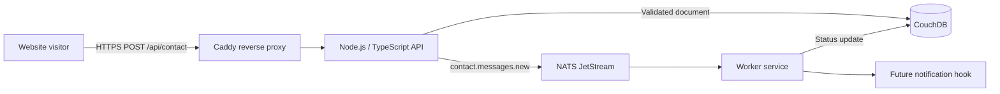
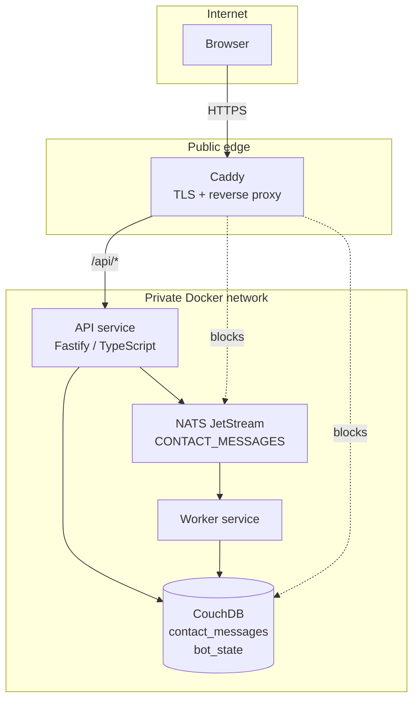
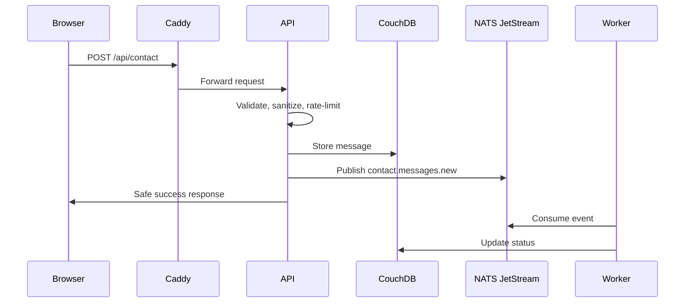
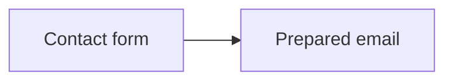
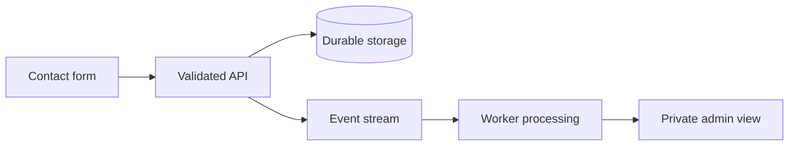
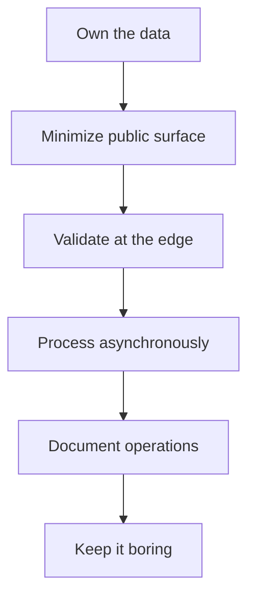

# Building Small, Secure Infrastructure for Event Processing

## How RO IT Systems vibe-coded the hardening of our publicfacing website and private message-ingestion stack.

We cannot always talk about what we do for clients.

That is the nature of serious consulting work. The most valuable engagements often involve sensitive architecture, operational risk, governance gaps, internal platforms, security posture, AI readiness, data protection, or leadership decision-making that belongs to the client — not to us.

So, in the spirit of transparency, this post does something different.

Instead of describing client work, it walks through how we hardened part of our own infrastructure: the public RO IT Systems website and the private message-ingestion system behind it. This gives prospective clients a practical view of how we think, how we work, and what “secure enough to operate” means in a real, small, owned system.

This is not a grand enterprise platform. That is the point.

It is a focused example of responsible engineering: take a simple public interaction, reduce the attack surface, protect private services, validate inputs, store messages durably, process events asynchronously, document operations, and leave room for future automation without overbuilding.

## Executive summary

This kind of hardening exercise is not just a technical cleanup. It is an executive risk-control exercise.

For senior leadership, the outcome is a system that is easier to trust, easier to operate, and easier to explain.

It provides reduced exposure by keeping databases, brokers, and internal services off the public internet; clearer accountability through documented architecture, deployment, backup, restore, and operating procedures; stronger privacy posture by limiting where personal information flows and avoiding secrets in code or logs; improved resilience through durable storage, asynchronous event processing, retries, health checks, and graceful failure paths; better governance because security expectations are translated into concrete engineering controls; faster delivery with lower ambiguity because AI-assisted coding is guided by explicit standards and acceptance criteria; and a foundation for future automation, such as admin workflows, notification bots, CRM routing, or mobile review, without surrendering control to unnecessary third-party platforms.

The leadership value is not that the stack is exotic. It is that the system is understandable, bounded, documented, and aligned with operational risk.

That is what responsible technical delivery should provide: confidence that the organization can move quickly without losing control of its data, its systems, or its obligations.

## The problem

Most small business websites do one of two things with contact forms.

They either send an email directly, or they hand the whole problem to a third-party form platform.

That works until you care about privacy, operational control, resilience, observability, and what happens next.

For RO IT Systems, the problem was simple: we needed secure, lightweight event processing without relying on third-party platforms. The public website needed a clean contact experience. The backend needed to receive messages, store them durably, process them asynchronously, and remain small enough to run affordably on a single DigitalOcean droplet.

The result was `roitsystems-infra`: a private message-ingestion infrastructure using Caddy, CouchDB, NATS JetStream, a Node.js/TypeScript API, and a worker service.

The build brief described the goal as creating a private RO IT Systems message-ingestion infrastructure on DigitalOcean, using CouchDB as durable NoSQL storage and NATS JetStream as the lightweight event broker.

This was also an exercise in applied AI-assisted delivery. The security and hardening prompt came from my consulting project in ChatGPT, where I maintain patterns and standards for platform hardening. Copilot Studio then implemented the code changes.

The human role was not replaced. It shifted upward: architecture, constraints, review, security judgment, and operational intent.

## What the old contact form could not do

The old contact form was good enough for a static website. It opened a prepared email.

That was simple, but it had limits: no durable message record, no event stream, no processing status, no private mobile-friendly admin view, no clean path to future notification bots, and no structured security boundary between public website and backend.

The goal was not to build an enterprise service bus.

The goal was to build a small, owned, inspectable system that could do one thing well.

Accept an inquiry. Store it. Publish an event. Process it. Keep the private systems private.

## What we needed



The public website remains the front door. The infrastructure stack is the private receiving room behind it.

The backend exposes a public `POST /api/contact` endpoint, validates and rate-limits submissions, stores messages in CouchDB, publishes events to NATS JetStream, and returns a safe success response. The worker consumes those events and updates message status.

The original build requirements called for Caddy or Traefik for automatic HTTPS/TLS, CouchDB as durable NoSQL message storage, NATS JetStream as the lightweight event broker, and a small API service in Node.js/TypeScript or Python/FastAPI.

## The architecture



The stack deliberately avoids exposing CouchDB or NATS directly. Only the reverse proxy binds public ports. The build requirements explicitly called for the reverse proxy to route public API requests while blocking direct public access to CouchDB and NATS admin ports unless explicitly protected.

That matters. A lot of small systems fail not because the code is complicated, but because the private parts accidentally become public.

## The message flow



The contact form no longer needs to know anything about infrastructure. It does not hold secrets. It does not reveal internal errors. It submits a structured payload and receives a simple success or failure state.

The required payload included fields such as name, email, company, subject, message, source page, timestamp, consent, and a honeypot anti-spam field.

## The hardening prompt was the architecture

The most important artifact in this exercise was not the code. It was the prompt.

The hardening prompt did what a good security brief should do: it turned a vague intention — “make this safer” — into a structured engineering mandate.

It named the systems in scope: the public Node.js website and the private infrastructure, messaging, and deployment codebase.

It defined the goals: reduce attack surface; improve secure defaults; harden HTTP, Node.js, dependency, secrets, logging, and deployment posture; improve infrastructure messaging reliability and safety; and document all security-sensitive changes.

That mattered because AI coding tools are at their worst when they are handed ambiguity and at their best when they are given constraints, acceptance criteria, and a reviewable target state.

The prompt did not ask Copilot Studio to “add security.” It asked for specific security behaviours.

It asked for secure headers, HTTPS assumptions, a sane content security policy, restricted CORS, rate limiting, request-size limits, safe error handling, input validation, secret handling, log redaction, dependency review, container hardening, health checks, graceful shutdown, and documentation.

For the infrastructure messaging system, it went further. It asked for message schema validation, retry handling, idempotency, timeout and backoff behaviour, event-processing logs, environment separation, and protection against secrets leaking through payloads.

That is the difference between vibe coding and governed AI-assisted delivery.

The prompt became the control surface.

## The redacted hardening prompt

The actual prompt contained system names and deployment details. A redacted version is safe to show here.

```text
You are a senior application security engineer and platform hardening specialist.

Task: harden both codebases:

1. [PUBLIC_WEBSITE_REPO] — public Node.js website
2. [INFRA_REPO] — infrastructure / messaging / deployment codebase

Work carefully. Do not break production behaviour. Make small, reviewable commits or clearly separated change groups.

Primary goals:
- Reduce attack surface
- Improve secure defaults
- Harden HTTP, Node.js, dependency, secrets, logging, and deployment posture
- Improve infrastructure messaging reliability and safety
- Add clear documentation for all security-sensitive changes

Scope of work:

1. Repository assessment
- Inspect package.json, lockfiles, build scripts, runtime entrypoints, environment variable use, API routes, middleware, deployment config, Dockerfiles, CI/CD, IaC, and messaging code.
- Identify risks before changing code.
- Create a short SECURITY_HARDENING_NOTES.md with findings, changes made, remaining risks, and manual follow-up items.

2. Node.js / web hardening for [PUBLIC_WEBSITE_REPO]
- Add or verify Helmet or equivalent secure headers.
- Enforce HTTPS assumptions behind proxy/load balancer where applicable.
- Add sane Content Security Policy suitable for the current site.
- Disable or avoid exposing X-Powered-By.
- Add rate limiting where public endpoints exist.
- Add request size limits.
- Validate and sanitize all user-controlled inputs.
- Ensure no secrets, tokens, stack traces, or internal errors leak to users.
- Add structured error handling with safe public messages.
- Ensure logs are useful but do not expose secrets or PII.
- Review CORS policy and make it least-privilege.
- Review cookie/session settings if used: HttpOnly, Secure, SameSite, short lifetime.
- Confirm static asset serving does not expose hidden files, source maps, env files, or internal directories.

3. Dependency and supply-chain hardening
- Run npm audit or equivalent and fix safe upgrades.
- Remove unused dependencies.
- Pin or respect lockfile integrity.
- Add npm scripts for:
  - security audit
  - lint
  - test
  - build
- Ensure dependency updates do not introduce breaking changes without documenting them.
- Add .npmrc hardening if appropriate, including audit=true and fund=false if suitable.

4. Infrastructure / messaging hardening for [INFRA_REPO]
- Inspect message broker, queue, pub/sub, webhook, or event-processing code.
- Ensure messages have schema validation.
- Add dead-letter or retry handling where appropriate.
- Ensure idempotency for message processing where duplicate delivery is possible.
- Add timeout, backoff, and circuit-breaker style safeguards where external systems are called.
- Ensure message payloads do not include secrets.
- Add clear logging around message receipt, processing, failure, retry, and dead-letter actions.
- Ensure logs avoid sensitive data.
- Confirm environment separation for dev/staging/prod.
- Review credentials, connection strings, broker URLs, API keys, and secrets handling.
- Move hardcoded secrets to environment variables or documented secret stores.
- Add example env files only with placeholder values.

5. Deployment and runtime hardening
- Review Dockerfile/container config if present:
  - non-root user
  - minimal base image
  - no unnecessary packages
  - no secrets baked into image
  - healthcheck if appropriate
  - NODE_ENV=production
- Review [CLOUD_PROVIDER] / App Platform / deployment config if present.
- Confirm production builds do not expose dev tooling.
- Add healthcheck endpoint only if it does not leak internals.
- Add readiness/liveness distinction if useful.
- Add graceful shutdown handling for HTTP server and message workers.

6. Security documentation
Create or update:
- SECURITY.md with responsible disclosure/contact placeholder.
- .env.example with required variables and safe placeholder values.
- HARDENING_CHECKLIST.md with completed and remaining items.
- README updates for local secure development and production deployment.

7. Testing
- Run existing tests.
- Add minimal tests for:
  - security headers
  - input validation
  - message validation / malformed message rejection
  - graceful failure paths
- Confirm npm run build succeeds.
- Confirm npm run lint succeeds if lint exists or is added.
- Do not leave the repo in a broken state.

8. Output expected
At the end, provide:
- Summary of risks found
- Summary of files changed
- Commands run
- Tests passed/failed
- Any changes that require environment updates in hosting, DNS, secrets, or deployment settings
- Remaining recommended manual actions

Constraints:
- Preserve existing UX, branding, routing, and content.
- Do not rotate or invent secrets.
- Do not commit real credentials.
- Do not add heavyweight frameworks unless clearly justified.
- Prefer boring, maintainable, standard Node.js security practices.
- Ask before making destructive changes.
- If uncertainty exists, document it and choose the safer, reversible option.
```

This is the kind of prompt that lets AI-assisted development stay inside a governed delivery frame. It establishes scope, controls, tests, documentation, and the boundary between safe automation and human judgment.

## What the hardening achieved

The public website became safer without becoming more complicated for visitors.

The contact form stopped behaving like a local email shortcut and became a proper client of a secure backend API. It now submits structured data, relies on server-side validation, avoids exposing secrets, and gives users clear success or error states.

The infrastructure became more defensible.

Instead of exposing a database or broker to the internet, the design places Caddy at the public edge and keeps CouchDB and NATS JetStream on a private Docker network. Only the API endpoint is public. The private systems remain private.

The messaging path became operationally useful.

A valid contact message is accepted, validated, stored durably in CouchDB, published as a NATS JetStream event, consumed by a worker, and updated with processing status. That creates a foundation for future notification bots, admin workflows, mobile access, and auditability.

The deployment became more repeatable.

The repo carries the operational scaffolding that small systems often lack: `.env.example`, deployment notes, health checks, backup and restore guidance, security notes, and a documented architecture. That turns the system from “some code on a server” into something that can be operated.

The hardening also exposed useful implementation realities.

For example, the first deployment surfaced practical issues around SSH keys, Docker installation, `npm ci` requiring a lockfile, and container health checks in Alpine images. Those are not failures of the architecture. They are exactly the kinds of edge conditions a real hardening exercise is supposed to flush out before the system becomes business-critical.

## Before and after

Before:



After:



This is not just a contact form anymore. It is a lightweight owned messaging system.

## Why this matters for consulting clients

The lesson is bigger than this website.

A lot of organizations are being pushed toward platform sprawl. A contact form becomes a SaaS tool. A notification becomes another SaaS tool. A queue becomes another SaaS tool. A dashboard becomes another SaaS tool. Then governance, privacy, logging, retention, and operational accountability become scattered across vendors.

That can be the right answer at scale.

But it is not always the right first answer.

Sometimes the better architecture is a small, well-bounded system with clear ownership.



This is the kind of engineering I like: practical, secure, explainable, and not overbuilt.

## The AI-assisted delivery model

This exercise also shows where AI-assisted software delivery is becoming useful.

The prompt defined the intent: reduce attack surface, improve secure defaults, harden HTTP and Node.js behaviour, improve messaging reliability, protect secrets, and document the result. Copilot Studio implemented code changes within that frame.

That matters because AI coding tools are much more useful when they are not asked to “make it secure” in the abstract.

They need architecture. They need standards. They need acceptance criteria. They need a human operator who knows what good looks like.

The prompt asked for specific controls: HTTPS, CORS restrictions, input validation, rate limiting, durable storage, private broker access, dead-letter or retry handling, safe logging, environment-based secrets, Docker hardening, health checks, and documentation.

Those are not vibes.

They are engineering constraints.

## Why this matters for senior leadership

Senior leaders do not need to know every line of code in a system like this.

They do need to know whether the system is governed.

This kind of work answers leadership-level questions: what is exposed to the internet; where sensitive information goes; what happens when something fails; whether the organization can recover from operational mistakes; whether secrets are handled safely; whether the system can be explained to a board, auditor, insurer, or regulator; and whether automation is being built on a controlled foundation or creating new uncontrolled risk.

The answer should not be “trust us, it is technical.”

The answer should be a clear architecture, documented controls, repeatable deployment, and explicit residual risks.

That is what this exercise was about.

## What I like about the final design

It is small.

It is inspectable.

It separates the public website from the private processing layer.

It supports future automation without forcing it on day one.

It gives RO IT Systems a private event-processing base that can grow into notification workflows, CRM-style routing, Signal or email alerts, and mobile review without rebuilding the foundation.

And it avoids one of the most common small-system mistakes: treating the website, the database, the queue, and the admin surface as if they all deserve the same exposure to the internet.

They do not.

## Closing thought

Good infrastructure does not need to be huge to be serious.

For a small consulting business, this was the right kind of hardening exercise: take a simple public interaction, move it behind a safer boundary, store the data durably, create an event stream, and leave room for automation.

That is the pattern I want more organizations to adopt with AI and automation generally.

Start small. Own the risk. Harden the edges. Keep the private parts private. Document the system well enough that future you can operate it under pressure. Add tech debt to your backlog.

That is responsible engineering.

High velocity, but not reckless.

Automated, but not ungoverned.

Practical, but still serious about risk.

Compliant but not buried in admin.

## Standards and Guidelines Reflected in the Hardening Work

This hardening exercise is not a claim of formal certification or audited compliance. It is a practical implementation aligned with recognized security, privacy, governance, and operational-resilience guidance.

| Standard / Guideline | One-line relevance |
|---|---|
| **NIST Cybersecurity Framework 2.0** | Aligns the work to risk governance, protection, detection, response, and recovery practices. |
| **OWASP Top 10 / OWASP Web Security Guidance** | Supports controls for input validation, safe error handling, rate limiting, security headers, CORS, and information-leak prevention. |
| **CIS Critical Security Controls v8** | Maps to practical safeguards for secure configuration, access control, logging, vulnerability management, and data protection. |
| **PIPEDA Safeguards Principle** | Supports Canadian privacy expectations by protecting personal information against unauthorized access, disclosure, loss, or misuse. |
| **ISO/IEC 27001 Control Themes** | Reflects information-security management practices such as access control, logging, backup, secure operations, and documented controls. |
| **Secure-by-Design Principles** | Builds security into the architecture by minimizing public exposure and keeping private services private. |
| **Privacy-by-Design Principles** | Limits unnecessary third-party data sharing and reduces where personal information flows. |
| **DevSecOps Practices** | Integrates security into build, deployment, dependency review, configuration, testing, and documentation. |
| **Cloud Security Best Practices** | Uses least exposure, environment-based secrets, firewalling, health checks, and repeatable deployment on cloud infrastructure. |
| **Event-Driven Architecture Reliability Patterns** | Uses durable storage, asynchronous processing, worker status updates, retries, and operational observability. |
